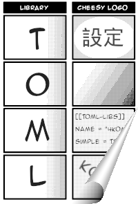

# 4koma
[](https://jitpack.io/cc/ekblad/4koma/latest/javadoc/)
[](https://jitpack.io/#cc.ekblad/4koma)


[](https://github.com/valderman/4koma/blob/main/LICENSE)



A small, stand-alone, easy to use TOML parser library for Kotlin.

4koma supports an array of convenient features, such as full TOML 1.0 compliance,
type-safe conversions of configurations into arbitrary data classes using Kotlin generics,
and easy access to individual properties for when you don't need the entire document.

4koma follows the UNIX philosophy, in that it tries to do one thing (i.e. TOML processing for Kotlin projects),
and do it well.
If you need support for multiple configuration formats, or are using a JVM language other than Kotlin,
some of the projects listed in the [Alternatives](#alternatives) section might serve you better.


## Usage
Getting started with 4koma is super easy.

### 1. Add a dependency on 4koma
For `build.gradle.kts`:
```kotlin
repositories {
    maven {
        url = uri("https://jitpack.io")
    }
}

dependencies {
    implementation("cc.ekblad:4koma:0.2.0")
}
```

### 2. Obtain a TOML file
```toml
[settings]
maxLoginTries = 3

[[user]]
name = "Alice"
password = "password123"

[[user]]
name = "Bob"
password = "correct horse battery staple"
```

### 3. Write some code
```kotlin
import cc.ekblad.toml.TomlValue
import cc.ekblad.toml.convert
import cc.ekblad.toml.get
import java.nio.file.Path

data class Config(
    val settings: Settings,
    val user: List<User>
) {
    data class User(val name: String, val password: String)
    data class Settings(val maxLoginRetries: Int)
}

fun main() {
    // Parse a TOML document from a string, stream, or file
    val tomlDocument = TomlValue.from(Path.of("test.toml"))

    // Convert it to your config type
    val config = tomlDocument.convert<Config>()

    // If you're lazy, just convert it to a map
    val mapConfig = tomlDocument.convert<Map<String, Any>>()

    // ...or access properties directly
    val maxLoginTries = tomlDocument["settings", "maxLoginTries"]

    // ...or just grab a part of the document and convert it to some convenient data class
    val settings = tomlDocument.get<Config.Settings>("settings")
    val users = tomlDocument.get<List<User>>("user")

    // You can also access properties on objects inside lists
    val userNames = tomlDocument["user", "name"] // <- returns listOf("Alice", "Bob")
}
```
For more detailed information, see the [API documentation](https://jitpack.io/cc/ekblad/4koma/latest/javadoc/).

## <span id="alternatives">Alternatives</span>

Why should you use 4koma? Maybe you shouldn't! When it comes to TOML libraries there are several to choose from.
This table compares 4koma with a number of alternatives that (a) can parse TOML, (b) can be reasonably easily used in
a Kotlin/JVM project, and (c) have seen at least one new commit in the last four years.

If you'd like your library to be on your list, or it's already there and you believe it's being misrepresented,
please open a pull request to rectify the situation.

| Feature | 4koma | [KToml](https://github.com/akuleshov7/ktoml) | [konf](https://github.com/uchuhimo/konf) | [konfy](https://github.com/TanVD/konfy) | [toml4j](https://github.com/mwanji/toml4j) | [tomlj](https://github.com/tomlj/tomlj) | [jtoml](https://github.com/agrison/jtoml) | [Night Config](https://github.com/TheElectronWill/Night-Config) | [Jackson](https://github.com/FasterXML/jackson-dataformats-text)
| -------------------------------- | :--: | :--: | :--: | :--: | :--: | :--: | :--: | :--: | :--: |
| TOML 1.0 compliant               |  ✅  |  ❌  |  ✅  |  ❌  |  ❌  |  ❌  |  ❌  |  ✅  |  ✅  |
| TOML 0.4 compliant               |  ✅  |  ❌  |  ✅  |  ❌  |  ✅  |  ✅  |  ❌  |  ✅  |  ✅  |
| Inline tables                    |  ✅  |  ❌  |  ✅  |  ❌  |  ✅  |  ✅  |  ❌  |  ✅  |  ✅  |
| Table arrays                     |  ✅  |  ❌  |  ✅  |  ❌  |  ❌  |  ✅  |  ❌  |  ✅  |  ✅  |
| Date/time literals               |  ✅  |  ❌  |  ✅  |  ❌  |  ❌  |  ✅  |  ✅  |  ✅  |  ✅  |
| Easy property access¹            |  ✅  |  ❌  |  ✅  |  ❌  |  ✅  |  ✅  |  ✅  |  ✅  |  ✅  |
| Conversion to Kotlin types       |  ✅  |  ✅  |  ✅  |  ✅  |  ✅  |  ❌  |  ✅  |  ✅  |  ✅  |
| ...without extra boilerplate²    |  ✅  |  ❌  |  ❌  |  ❌  |  ✅  |  ❌  |  ✅  |  ✅  |  ✅  |
| ...without modification to type  |  ✅  |  ❌  |  ❌  |  ❌  |  ✅  |  ❌  |  ✅  |  ✅  |  ✅  |
| Type-safe generic conversion³    |  ✅  |  ❔  |  ✅  |  ✅  |  ❌  |  ❌  |  ❌  |  ❌  |  ❌  |
| Kotlin multiplatform             |  ❌  |  ✅  |  ❌  |  ❌  |  ❌  |  ❌  |  ❌  |  ❌  |  ❌  |
| Serialization                    |  ❌  |  ❌  |  ✅  |  ❌  |  ✅  |  ❌  |  ✅  |  ✅  |  ✅  |
| Online API docs                  |  ✅  |  ❌  |  ❌  |  ❌  |  ❌  |  ✅  |  ❌  |  ✅  |  ✅  |
| Small and lean⁴                  |  ✅  |  ✅  |  ❌  |  ❌  |  ✅  |  ✅  |  ✅  |  ❌  |  ❌  |
| Everything but the kitchen sink⁵ |  ❌  |  ❌  |  ✅  |  ✅  |  ❌  |  ❌  |  ❌  |  ✅  |  ✅  |

(¹) Individual properties can be accessed by means of `parsedConfig.get("foo.bar")` or similar,
without requiring the entire document to be converted into some model type.

(²) The library does not require annotations or other modifications to existing code in order to support conversion
to complex model types.

(³) The library does not rely on type-erased JVM generics for conversion to complex model types.

(⁴) The library focuses on reading/writing/processing TOML and does not contain any "unnecessary" features
unrelated to that scope.

(⁵) The library aims to provide a comprehensive configuration platform, with support for multiple configuration file
formats and all sorts of associated bells and whistles.